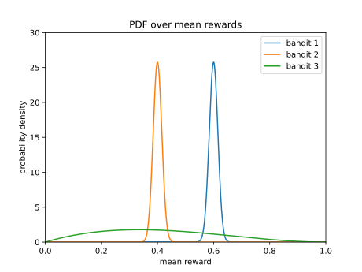

# Multi-armed bandits
Multi-armed bandits, learned from the class [CMU 10-403](https://cmudeeprl.github.io/403website_s24/), are k slot machines. At each time step, 
the agent has to choose one out of k slot machines to play. The reward of a slot machine is drawn from a distribution ${P_k}$ with mean ${\mu_k}$. 
The agent knows nothing about either ${P_k}$ or ${\mu_k}$ and wants to maximize its cumulative rewards.

Besides, in the dynamic condition, bandits are non-stationary. That is to say mean ${\mu_k}$ can change gradually.

To maximize its cumulative rewards, the agent wants to exploit, playing the slot machine with the highest mean as many times as possible. At 
the same time, the agent needs to explore, playing different slot machines more times to estimate their respective means more accurate. 
Otherwise, it may stuck in a suboptimal choice.

$${q_{\ast}(a)\doteq E[R_t|A_t=a],\ \forall\ a\in [1,...,k]}$$
$${Q_t(a)\approx q_{\ast}(a)}$$
$${A_t^*\doteq\arg\max_{a} Q_t(a)}$$

- Exploitation: Make the best decision *given current information*, if ${A_t=A_t^*}$
- Exploration: Gather more information, if ${A_t\neq A_t^*}$

What should the agent do?

# Greedy
The greedy algorithm explores at first within a fixed time period and then likely exploits for the rest of time. As the example in Figure 1, 
if the greedy algorithm picks bandit 3 during the fixed time period, it will most likely switch to the bandit 1 some time later after the 
fixed time period. However, if what the greedy algorithm picks during the fixed time period is bandit 1, it is very unlikely to explore the 
other bandits. It makes sense not to explore on bandit 2, but there is still some chance that bandit 3 may outperform bandit 1.

1. Choose a fixed time period ${t_{fixed}}$.
2. For time step t less than or equal to ${t_{fixed}}$, do the followings.
    - Try slot machines uniformly at random for ${a_t}$.
    - Increase ${N_t(a)}$ by one, which represents the cumulative number of times that action a is taken at time t.
3. Estimate mean rewards ${Q_t(a)}$ for all actions as the equation in the below.
4. For time step t greater than ${t_{fixed}}$, do the followings until t is greater than the maximum time period.
    - Choose the action ${a_t}$ as the equation in the below.
    - Increase ${N_t(a)}$ by one.
    - Estimate mean rewards ${Q_{t+1}(a)}$ for all actions as the equation in the below.

$${a_t=\arg\max_{a} Q_{t}(a)}$$
$${Q_{t+1}(a)=\begin{cases}
  \frac{N_t(a)-1}{N_t(a)} \cdot Q_t(a)+\frac{1}{N_t(a)} \cdot r_t, & \text{if $A_t=a$}\\
  Q_t(a), & \text{otherwise}
\end{cases}}$$

# ${\epsilon}$-Greedy
The ${\epsilon}$-greedy algorithm continues to explore forever at a probability of ${\epsilon}$. That gives us some opportunities to explore 
more on bandit 3. However, the ${\epsilon}$-greedy algorithm spends equal opportunities to explore on bandit 2. It's wasteful. 

1. For time step t less than or equal to the maximum time period, do the followings.
    - With probability ${\epsilon}$, try slot machines uniformly at random for ${a_t}$.
    - With probability ${1-\epsilon}$, choose the action ${a_t}$ as the equation in the below.
    - Increase ${N_t(a)}$ by one.
    - Estimate mean rewards ${Q_{t+1}(a)}$ for the action to be considered later time.

$${a_t=\arg\max_{a} Q_t(a)}$$
$${Q_{t+1}(a)=\begin{cases}
  \frac{N_t(a)-1}{N_t(a)} \cdot Q_t(a)+\frac{1}{N_t(a)} \cdot r_t, & \text{if $A_t=a$}\\
  Q_t(a), & \text{otherwise}
\end{cases}}$$

# Decaying ${\epsilon}$-Greedy
The decaying ${\epsilon}$-greedy algorithm works almost the same as the ${\epsilon}$-greedy algorithm, except the way to estimate ${Q_t(a)}$.
A constant ${\alpha}$ is introduced to keep the weight of ${r_t}$ the same over time. It forgets earlier rewards exponentially at the rate of 
${1-\alpha}$.

1. For time step t less than or equal to the maximum time period, do the followings.
    - With probability ${\epsilon}$, try slot machines uniformly at random for ${a_t}$.
    - With probability ${1-\epsilon}$, choose the action ${a_t}$ as the equation in the below.
    - Increase ${N_t(a)}$ by one.
    - Estimate mean rewards ${Q_{t+1}(a)}$ for the action to be considered later time.

$${a_t=\arg\max_{a} Q_t(a)}$$
$${Q_{t+1}(a)=\begin{cases}
  (1-\alpha) \cdot Q_t(a) + \alpha \cdot r_t, & \text{if $A_t=a$}\\
  Q_t(a), & \text{otherwise}
\end{cases}\text{, where } \alpha \in (0,1] \text{ and constant}}$$

# Upper Confidence Bounds (UCB)
The agent wants to play the slot machine which can give it the highest reward over time. However, the agent does not know the real mean 
reward of each slot machine. To estimate these real mean rewards, the agent has to draw samples from each slot machine and uses these sample 
means as estimations with uncertainty. The more uncertain an estimation is, the more likely the respective real mean reward can be higher 
than the sample mean, and the more times the agent should explore the opportunity. So, if we have an upper bound ${U_t(a)}$ like:

$${q_{\ast}(a) \leq Q_t(a)+U_t(a)}$$

the agent that adopts the UCB algorithm should choose the action with highest ${Q_t(a)+U_t(a)}$.

[Hoeffding's inequality](https://en.wikipedia.org/wiki/Hoeffding%27s_inequality) gives us:

$${P(Q_{t+1}(a) \geq q_{\ast}(a)+U_{t+1}(a)) \leq \exp^{-2 \cdot U_{t+1}(a)^2 \cdot N_t(a)}}$$

Assuming ${p}$ represents the smallest probability on the left side above, after the simplification, we will get:

$${U_{t+1}(a)= \sqrt{\frac{-\log p}{2 \cdot N_t(a)}}}$$

A handy choice of ${p}$ is:

$${p=t^{-2 \cdot c^2} \text{, where ${c}$ is a constant}}$$

and we have a simpler upper bound:

$${U_{t+1}(a)=c \cdot \sqrt{\frac{\log t}{N_t(a)}}}$$

It grows with ${\log t}$ but shrinks with ${N_t(a)}$. The more often we choose a specific action ${a}$, the larger ${N_t(a)}$ is, and the 
less uncertain it become. The less often we choose a specific action ${a}$, the larger ${\log t}$ is, and the more uncertain it become. 
That ensures the agent will not stop exploring but still balances exploration and exploitation. 

1. For time step t less than or equal to the maximum time period, do the followings.
    - Choose the action ${a_t}$ as the equation in the below.
    - Update ${N_t(a)}$ as the equation in the below.
    - Calculate ${U_{t+1}(a)}$ as the equation in the below.
    - Estimate ${Q_{t+1}(a)}$ as the equation in the below.

$${a_t=\arg\max_{a} Q_t(a)+U_t(a)}$$
$${N_t(a)=\begin{cases}
  N_{t-1}(a)+1, & \text{if $A_t=a$}\\
  N_{t-1}(a), & \text{otherwise}
\end{cases}}$$
$${U_{t+1}(a)=c \cdot \sqrt{\frac{\log t}{N_t(a)}}}$$
$${Q_{t+1}(a)=\begin{cases}
  \frac{N_t(a)-1}{N_t(a)} \cdot Q_t(a)+\frac{1}{N_t(a)} \cdot r_t, & \text{if $A_t=a$}\\
  Q_t(a), & \text{otherwise}
\end{cases}}$$

# Thompson Sampling
[Thompson Sampling](https://arxiv.org/pdf/1707.02038) is mainly different from the greedy algorithm in the way of getting ${Q_{t+1}(a)}$. 
It does not estimate ${Q_{t+1}(a)}$. Instead, it samples ${Q_{t+1}(a)}$ from the posterior probability distribution. That means, unlike all 
the above algorithms, we need to know which probability distribution to use. Or, we need an approximation of the posterior probability 
distribution.

# Reference
- Carnegie Mellon University, Fragkiadaki, Katerina, et al. 2024. "10-403 Deep Reinforcement Learning" As of 8 November, 2024. 
https://cmudeeprl.github.io/403website_s24/.
- Sutton, Richard S., and Barto, Andrew G. 2018. Reinforcement Learning - An indroduction, second edition. The MIT Press.
